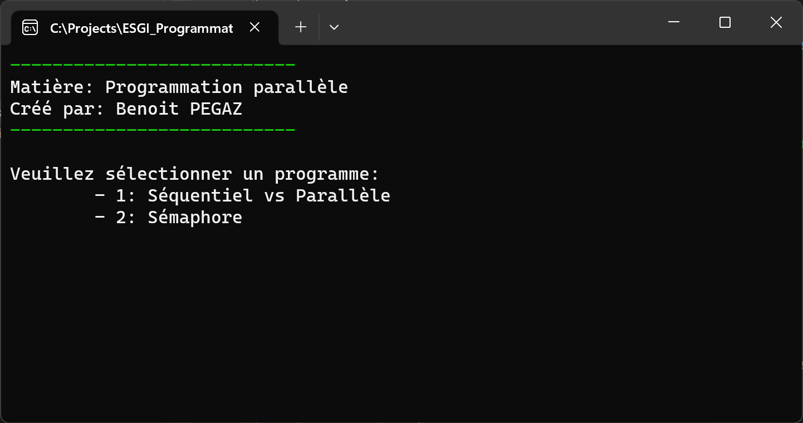
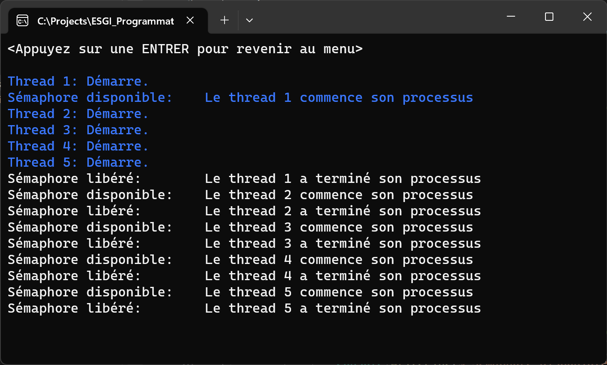
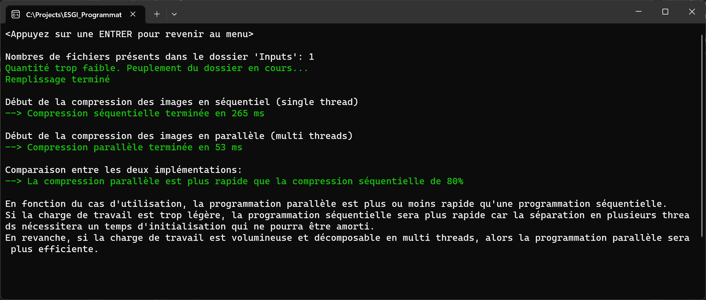

# ESGI - Programmation parallèle en C#

Développé en `.NET 7.0`
La solution contient l'implémentation de:
- [x] La comparaison entre la programmation séquentielle et la programmation parallèle:
Nous redimensionnons une grande quantité d'image et analysons le temps d'éxécution
- [x] Un sémaphore
Nous avons plusieurs threads qui souhaitent écrire dans un fichier. Nous créons un sémaphore pour contrôler l'accès concurrent à cette ressource partagée. 

## Installation
1. Téléchargez le dossier et ouvrez la solution
2. Exécutez la classe `Program.cs`.
3. Une fenêtre s'affiche:

Saisissez `1` ou `2` et validez avec la touche `Entrer`.
4. L'affiche se met à jour. Pour revenir au menu principal, appuyez sur `Entrer`

